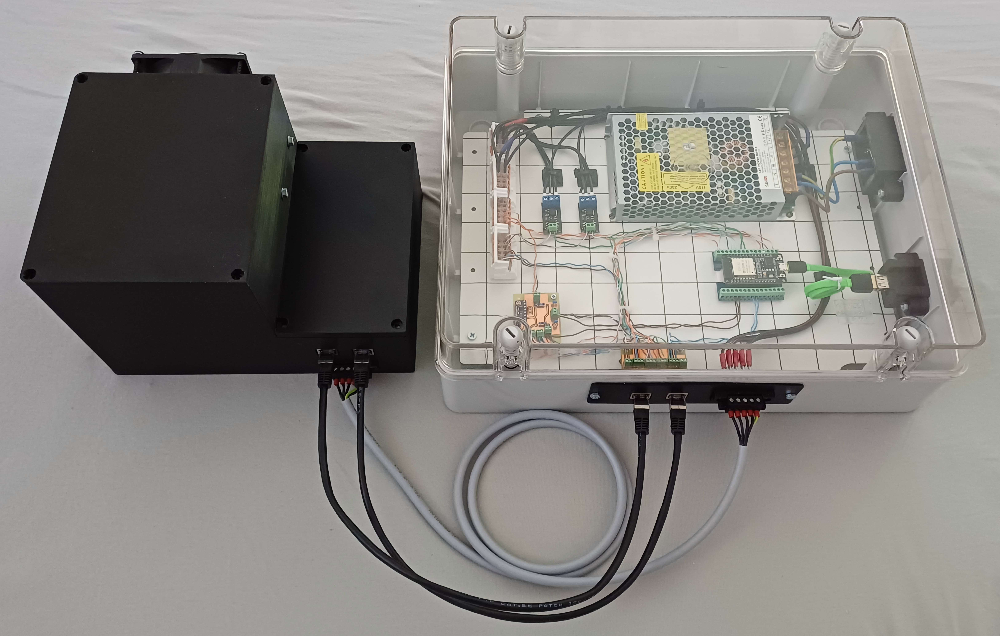
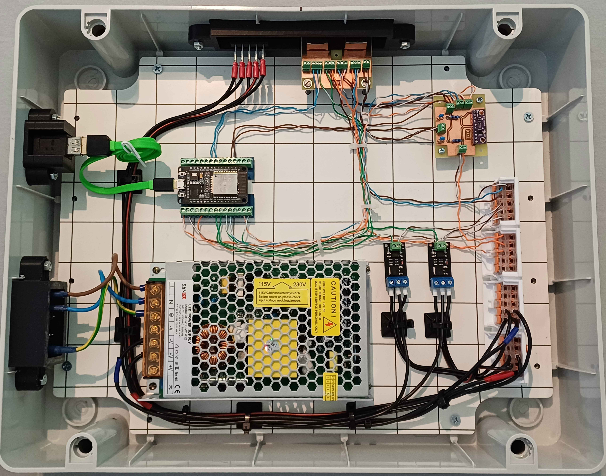
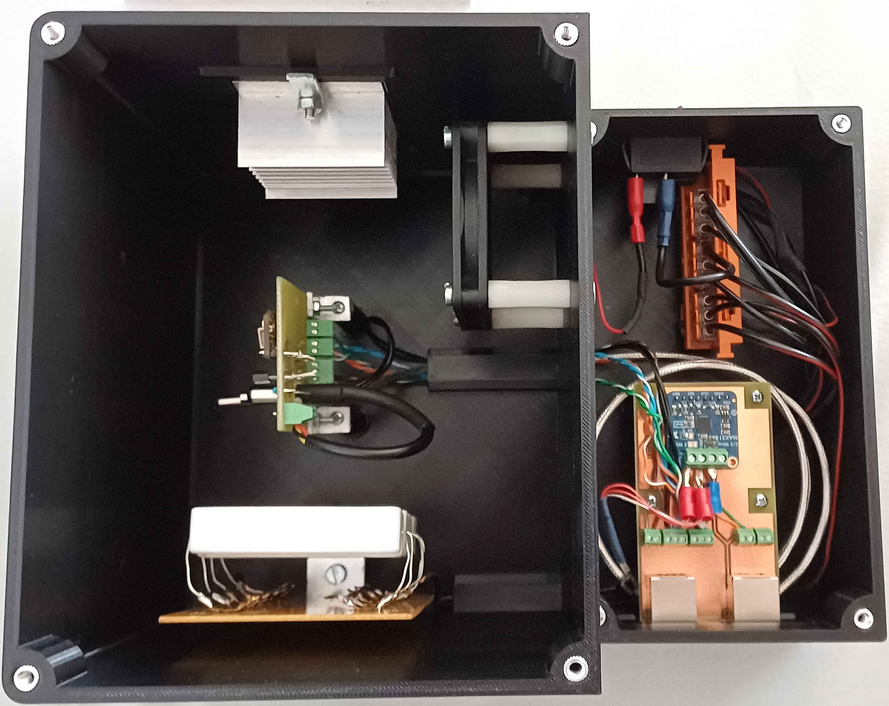
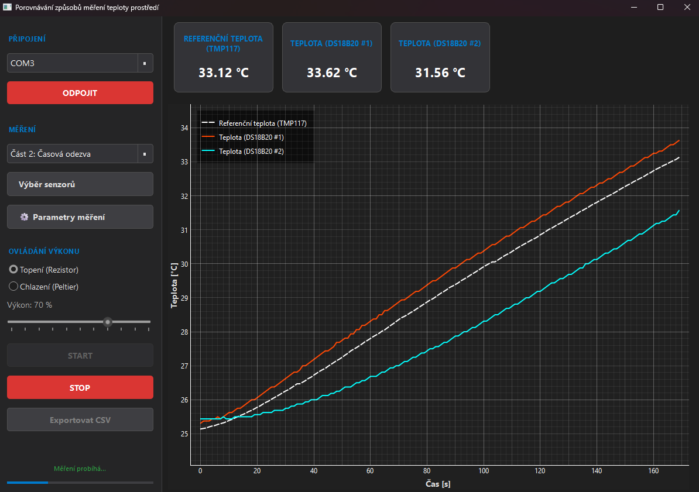

# Laboratory Exercise Focused on Ambient Temperature Measurement Methods



This repository contains the complete solution for a university laboratory exercise focused on comparing ambient temperature measurement methods. It includes hardware firmware, a pre-compiled desktop application, and raw source codes.

Developed as a Bachelor's thesis at the Brno University of Technology (BUT), the platform allows students to evaluate static accuracy and dynamic response of various sensor architectures (digital, analog, RTD) under controlled conditions.

## Repository Structure

* `Application/` - Ready-to-use compiled desktop application (`.exe`) including its internal assets and a specific readme.
* `Source codes/`
  * `ESP32-code/` - C++ firmware for the ESP32 microcontroller (PlatformIO project).
  * `Python app/` - Raw Python source codes for the desktop GUI.

---

## Hardware Specifications & Pinout

The measurement station is built around the **ESP32 DevKit v1**, with control electronics physically separated from the thermal chamber to minimize thermal interference.

<p align="center">
  
  
</p>

### Sensor & Actuator Configuration

| Component | Type / Interface | ESP32 GPIO | Notes |
| :--- | :--- | :--- | :--- |
| **TMP117** | Reference / I2C | 21 (SDA), 22 (SCL) | High-precision reference temperature sensor |
| **BME280** | Digital / I2C | 21 (SDA), 22 (SCL) | Combined temperature and humidity sensor |
| **ADS1115** | External 16-bit ADC | 21 (SDA), 22 (SCL) | I2C Address `0x49` (Measures NTC / Resistor) |
| **DS18B20** | Digital / OneWire | 4 | Supports multiple sensors on one bus, 4k7 pull-up |
| **MAX31865** | RTD Amplifier / SPI | 5 (CS), 23 (MOSI), 25 (MISO), 26 (CLK) | 3-wire connection for PT1000 |
| **Internal ADC** | Analog Input | 34 (Resistor), 35 (NTC) | 12-bit ESP32 ADC measurements |
| **Heater** | Actuator / PWM (Ch 0) | 18 | Power resistor switched via MOSFET |
| **Cooler** | Actuator / PWM (Ch 1) | 19 | Peltier module switched via MOSFET |

---

## Getting Started

To fully utilize the platform, you must configure both the hardware and the software components:

### 1. Hardware Setup (Firmware Flashing)
Before running the desktop application, the ESP32 microcontroller must be programmed. Running the application alone is not sufficient.
* Navigate to the `Source codes/ESP32-code/` directory.
* Open the project in PlatformIO.
* Build and upload the firmware to your ESP32 board.

### 2. Software Execution
For immediate use during laboratory exercises, simply navigate to the `Application/` folder and run the pre-compiled executable file. No Python installation or environment setup is required.



### 3. Development & Dependencies (Source Codes)
To run or modify the raw Python application located in `Source codes/Python app/`, you need Python 3.11+ and the following dependencies:
* `PySide6`
* `pyqtgraph`
* `pyserial`

Install the dependencies via pip:
```bash
pip install PySide6 pyqtgraph pyserial
```

---
#### AI Disclosure
During the development and documentation process, an AI language model (Google Gemini) was utilized as an assistant for code commenting, formatting, and structural refinement. All AI-generated outputs were thoroughly reviewed, modified, and validated by the author to ensure technical accuracy and strict alignment with the thesis requirements.
